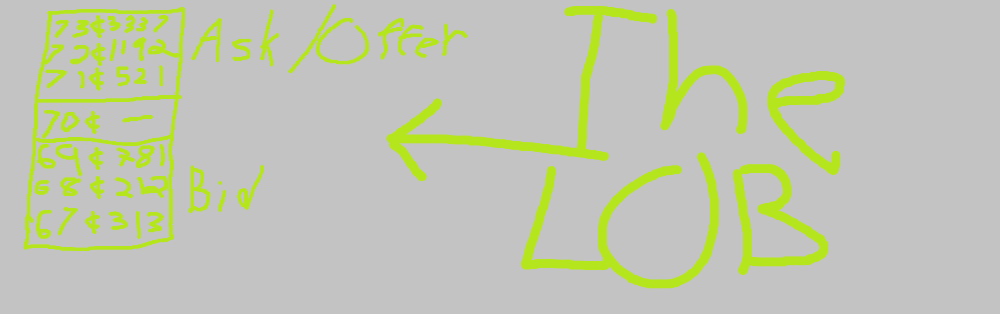
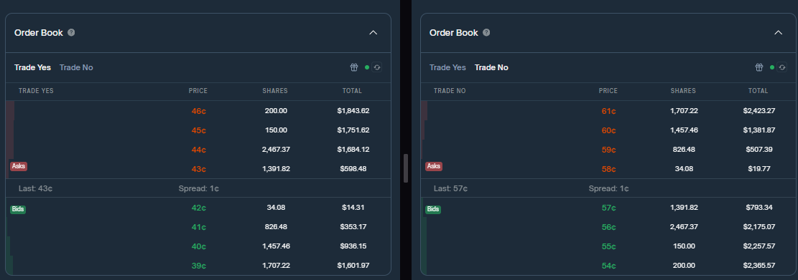
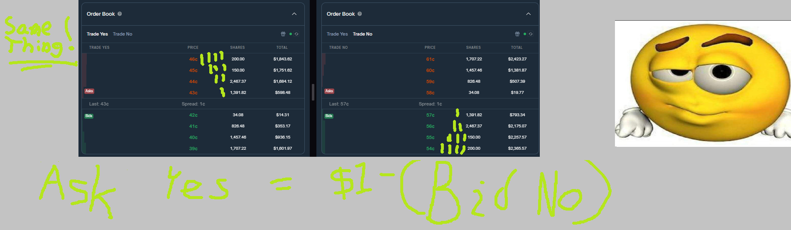
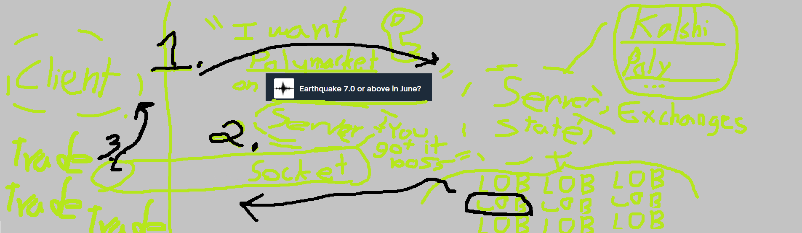

# PredMe : WORK IN PROGRESS

Welcome to PredMe, an engine for streaming real-time price data from prediction markets such as Polymarket, and Kalshi.

## What is the point?

Polymarket and kalshi both have their own fully supported developer APIs,
which is great until you compare the two and realize they are designed completely differently.
That means if you have a program to trade on one, it won't work with the other.

PredMe fixes this by consolidating the data across multiple prediction markets into one standard order book format.

## More Details

Here is what you need to know:

Traditional exchanges keep track of a __limit order book (LOB)__ for each market on the exchange.
This is how prices are determined.

Prediction markets also use LOBs for pricing the prediction contracts.
They make it seem like there are two markets per prediction: a bid/ask for 'yes' and a bid/ask for 'no':

But wait, the quantities listed for 'yes' are the exact same as that listed for 'no'.
It is redundant information!

 

### What does this mean

This means we only need to keep track of one LOB per prediction. 

Let us define a 'prediction' as having ownership of either a 'yes' contract or 'no' contract. 
PredMe then represents predictions from the 'yes' perspective. 
The bid price of 'yes', as listed on the exchange, is the bid price. 
The ask price is extrapolated from the bid price of 'no'.

## Project Structure

This project is divided into two main subcomponents: the client and the server.

The server keeps track of real time price data __via websocket__ directly from the exchange.
It does this by holding a set of order books, which are indexed with (`exchange`, `market`) pairs as keys in 
the __Server State__.

The client runs trading algorithms, UI, and basically everything to do with money.
It relies on the server to send up-to-date price information __as signals__ through a local __client-server socket__

### More Details:

1. Client somehow figures out which market it wants to recieve updates on and subscribes to the server by listing (exchange, market) pairs 
2. Server uses the key to get one of its LOBs, then sends the data through a socket
3. Client uses updates from the server to make trading decisions. By interfacing purely with data from the server, end users trading through the client won't need to re-write trading strategies for each exchange they want to trade on.

# Setup & Etc.

This project requires C++11 and pybind11 to build and run from source. See `build_cpp.sh` for proper build commands.

We use `uv` for managing python dependencies. It's not strictly necessary to use `uv`, but you must create a virtual environment named `.venv` located in the root of the project directory for the project to build and run properly.

For kalshi, you must set up the `.env` environment for **PROD**. The websocket API isn't available for Kalshi's demo environment.
See `example.env.txt` for reference.